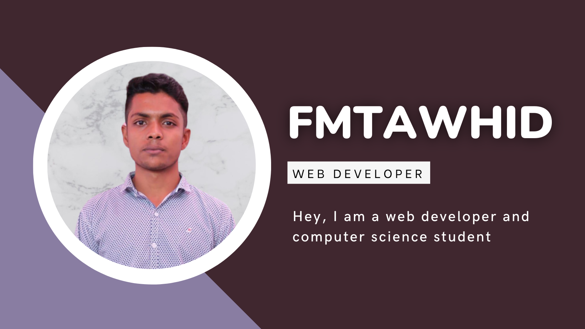

<!-- banner image starts here  -->
<!--    -->
<!-- banner image ends here  -->

<h1> 👋 Hello, I'm Tawhid Islam </h1>

A Part time Full Stack Web Developer & Full Time Learner  
🏠 &nbsp; Living: Dhaka, Bangladesh

<!-- Contact me section starts here  -->

[][youtube]
[][facebook]
[][linkedin]
 
 

<!-- Contact me section ends here  -->

<!-- about-me section starts here  -->

### 👨‍🏫 &nbsp; About Me

I am a passionate Full Stack Web Developer and Designer. I have completed many projects in programming languagI have had the opportunity to work on many programming related projects in my institute. After completing my SSC 2020, I am improving my web development skills. Every day I want to learn something new and share my knowledge with my Project and others.

 
<!-- about-me section ends here  -->

<!-- web related skills section starts here  -->

### 👨🏽‍💻 &nbsp; My Skills:

#### Main Skill :

 
 
 

<!-- web related skills section ends here  -->
<!-- other skills and my videos for computer science section starts here  -->

#### Other Basic Skills :

 
 
 

## Project

### Web Development Project
- https://github.com/users/fmtawhid/projects/7/
 
### Python Project
- https://github.com/users/fmtawhid/projects/7/
 
### Problem Solving Project
- https://github.com/users/fmtawhid/projects/7/
 
 

  <!-- other skills and my videos for computer science section ends here  -->

   

<!-- github stats starts here  -->

<!--  -->

 

<!-- github stats ends here  -->

 

<!-- other skills and my videos for computer science section starts here  -->

<!-- work experience section starts here  -->

 
<!-- work experience section ends here  -->
<!-- education section starts here  -->

### 👨🏻‍🎓 &nbsp; Education

1. Computer Science at Diploma in engineering 
   SSR Institute of Technology  
   Dhaka, Bangladesh.
   2022 - 2024
2. Computer Science at Diploma in engineering   
   Infra Polytechnic Institute 
   Barishal, Bangladesh.
   2020 - 2022
3. Secondary School Certificate  
   IB High School
   Barishal, Bangladesh.
   2016 - 2020

 

<!-- education section ends here  -->

<!-- my languages section starts here  -->

### Languages:

- 🇧🇩 Bangla : Native
- 🏴󠁧󠁢󠁥󠁮󠁧󠁿 English : Intermediate
- 🇮🇳 Hindi : Basic
- 🇧🇷 Gremany : Basic
   

<!-- my languages section ends here  -->

<!-- my sports and game section starts here  -->

### Sports / Game / Activities / Hobby:

- ⚽ Football, 🏸 Badminton, ♟️ Chess, 🏐 Volleyball
- 🏊‍♂️ Swimming, 🏃‍♂️ Running, 🚶‍♂️ Walking
- ✈️ Travelling

 
<!-- my sports and games section ends here  -->

<!-- Honors & awards section starts here  -->

### 🏅 Honors & Awards :

- Best Python in Infra Polytechnic Institute

---

Thanks for going through my Portfolio.
All rights reserved by fmtawhid @2023

---

<!-- my achievement section ends here  -->

<!-- Links section starts here -->

[youtube]: https://www.instagram.com/fmtawhid/
[facebook]: https://www.facebook.com/fmtawhid1
[linkedin]: https://www.linkedin.com/in/fmtawhid/
[github]: https://github.com/fmtawhid

<!-- web related playlists starts here  -->
[tikkaway]: https://fmtawhid.github.io/Tikkaway_Restaurant_Website/

<!-- Links section ends here -->
